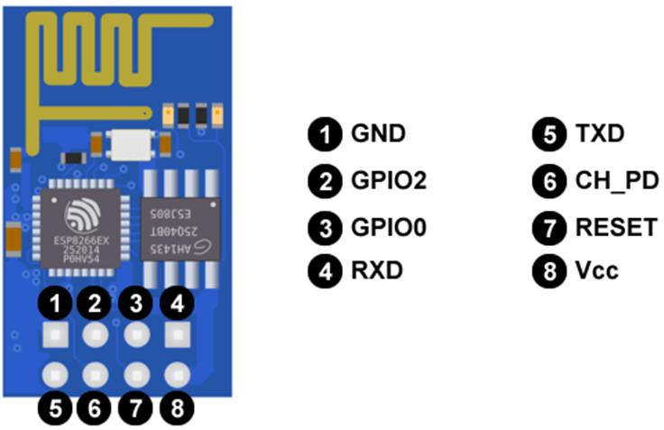

# 4100901-final-project
This repository contains the example for the final project of the course computation structures. Please go to the [C4Model](Doc/C4Model.md) diagrams for more details on the functionality of the system.

## Hardware prerequisites
* The example is a digital lock system featuring an STM32L4 for controling the system, an ESP8266 for interfacing with the internet, a keypad for getting the sequences, and an OLED display for GUI. See more details in the [C4Model](Doc/C4Model.md)
* The following is the pinout of the STM32:

## Theoretical basis
### ESP8266
* ¿Qué es el ESP8266?: Se trata de un chip integrado con conexión WiFi y compatible con el protocolo TCP/IP. El objetivo principal es dar acceso a cualquier microcontrolador a una red.
* La gran ventaja del ESP8266 es su bajo consumo. Es el producto ideal para wereables y dispositivos del IoT.
* Especificaciones del chip ESP8266
  * Hardware:
    * Utiliza una CPU Tensilica L106 32-bit
    * Voltaje de operación entre 3V y 3,6V
    * Corriente de operación 80 mA
    * Temperatura de operación -40ºC y 125ºC
  * Conectividad:
    * Soporta IPv4 y los protocolos TCP/UDP/HTTP/FTP
  * Puertos GPIO (de propósito general):
    * Tiene 17 puertos GPIO pero solo se pueden usar 9 o 10. El GPIO16 es especial ya que está conectado al RTC (Real Time Clock).
    * Pueden ser configurados con resistencia Pull-up o Pull-down.
    * Soporta los principales buses de comunicación (SPI, I2C, UART).
    

### STM32
La familia de microcontroladores STM32 está basada en núcleos ARM Cortex-M de 32 bits licenciados por la empresa Advanced RISC Machines Holdings Limited (ARM). Dentro de la misma familia se encuentra modelos que cuentan con un núcleo M0 hasta M7, con distintos periféricos y distintas cantidades de memoria RAM y Flash, con distintas prestaciones . Ofrece productos que combinan un rendimiento muy alto, en tiempo real, procesamiento de señales digitales, operación de baja potencia/bajo voltaje y conectividad, al mismo tiempo que mantiene una integración total y facilidad de desarrollo.

## Firmware prerequisites
* The ESP8266 runs the esp-link [v2.2.3](https://github.com/jeelabs/esp-link/releases/tag/v2.2.3) firmware. Please follow the [serial flashing guide](https://github.com/jeelabs/esp-link/blob/master/FLASHING.md#initial-serial-flashing).
* The STM32 runs the firmware compiled from this repository using STM32CubeIDE.

## Building and Flashing
* Open the project in STM32CubeIDE.
* Compile using the current project settings.
* Use an ST-LINK to flash the firmware into the STM32.

## Functionality
El proyecto tiene la funcionalidad principal  de implementación de una  cerradura digital, haciendo uso principalmente de una tarjeta de la familia de microcontroladores STM32 como es la Nucleó l746rg basada en núcleos ARM Cortex-M4 de 32 bits, de una pantalla  OLED I2C SSD1306 de 128x64, de un teclado  matricial de membrana 4x4 y un modulo WIFI esp8266 , y con dichas herramientas realizar el propósito mencionado, como es de que el usuario ingrese una clave predeterminada en el código y si dicha clave es ingresada incorrectamente  3 veces aparezca un estado de bloqueado (BLOCKED) , de lo contrario permita el acceso del usuario (SUCESS) , esto se implementará con los protocolos de comunicación tanto (USART e I2C) .

### Project Description
* Para realizar la implementación en la tarjeta NUCLEO-L476RG se identificó y configuro los periféricos necesarios para la cerradura digital. Donde se incluyó pines GPIO para el teclado o interfaz de usuario, Implementa el código para manejar la lógica de la cerradura digital. Esto podría incluir la entrada del código a través de un teclado, la verificación del código y otras funciones relacionadas con la cerradura, en el proyecto se tiene una interfaz de usuario, como es una pantalla OLED , donde se implementa el código necesario para interactuar con el usuario.

* En el código sabemos que se va a implementar el protocolo de comunicación USART y se sabe que este protocolo funciona por interrupción y por ende funciona con un Callbcak que es utilizado en situaciones en las que se manejan eventos, interrupciones o respuestas a condiciones específicas (Cuando se presiona el botón en el teclado) para el protocolo USART se recibe los datos por bajo nivel (LL), y mediante la pantalla OLED la cual se comunica por el protocolo de comunicación serial I2C que permite la transferencia de datos entre dispositivos haciendo uso de un cable para la transmisión de datos (SDA) y otro para la señal de reloj (SCL). Para la configuración de esta pantalla OLED Al programar, generalmente se utilizan librerias específicas que simplifican el proceso de comunicación I2C con la SSD1306, para el proyecto fue la librería SDD1306 que maneja los detalles de bajo nivel, permitiéndote centrarte en el contenido que deseas mostrar en la pantalla.

### The keypad
* Es la configuración de el teclado de membrana, donde este se caracteriza por tener un protocolo de comunicación USART, el cual puede funcionar tanto en modo síncrono como en modo asíncrono. En modo síncrono, el transmisor y el receptor comparten un reloj común, lo que elimina las pequeñas variaciones en la velocidad de transmisión. Esto es particularmente útil en entornos donde se requiere una sincronización precisa.
* Para ello se hizo uso de una librería, el código inicializa la funcionalidad del teclado estableciendo las filas en alto para ser detectadas en las columnas por interrupción ascendente. La función keypad_get_row debouncea e identifica eventos del teclado. Toma dos parámetros: COLUMN_x_GPIO_Port y COLUMN_x_Pin. La función devuelve el número de fila de la tecla presionada. La matriz keypad_map asigna los números de fila y columna al valor de tecla correspondiente

###The Debug console

###The internet interface

* The system sends metrics to the internet every 24h by using an alarm of the embedded RTC.

## Contact info
* Johan Eddy Chocue Otero - jchocueo@unal.edu.co
* Iván Andrés Vivas Pismag - ivivas@unal.edu.co